# Smart Home Simulation - Block Diagrams

## 1. General Setup Block Diagram

This diagram shows the overall system architecture and data flow between all components.

### Data Flow Description

1. **Sensors** continuously publish readings to the IoT Gateway
2. **IoT Gateway** broadcasts sensor data to:
   - Dashboard for visualization
   - Automation Rules Engine for evaluation
3. **Rules Engine** evaluates conditions and sends commands to devices
4. **Devices** receive commands and update their state
5. **Dashboard** displays real-time device states and sensor readings

---

## 2. HVAC Block Diagram Implementation

Detailed view of the HVAC automation logic with temperature, humidity, and motion sensors controlling the air conditioner.

```mermaid
flowchart TB
    subgraph Sensors["📡 HVAC Sensors"]
        Temp["🌡️ Temperature Sensor<br/>Current: 25°C"]
        Motion["🚶 Motion Sensor<br/>Occupancy Detection"]
        Humidity["💧 Humidity Sensor<br/>Current: 50%"]
    end
    
    subgraph Logic["⚙️ HVAC Control Logic"]
        TempCheck{"Temperature<br/>> 26°C?"}
        MotionCheck{"Motion<br/>Detected?"}
        HumidityCheck{"Humidity<br/>> 70%?"}
        NoMotionTimer{"No Motion<br/>> 5 min?"}
    end
    
    subgraph Actions["🎯 Control Actions"]
        ACOn["Turn AC ON<br/>Mode: Cool"]
        ACOff["Turn AC OFF"]
        HighFan["Set High Fan<br/>Dehumidify"]
    end
    
    subgraph Device["❄️ Air Conditioner"]
        ACState["Current State"]
        ACMode["Mode: Cool/Heat/Auto"]
        ACPower["Power: 1500W"]
    end
    
    subgraph Monitor["📊 Energy Monitor"]
        PowerConsumption["⚡ Power Consumption<br/>Real-time Display"]
        History["📈 Usage History"]
    end
    
    Temp --> TempCheck
    Motion --> MotionCheck
    Motion --> NoMotionTimer
    Humidity --> HumidityCheck
    
    TempCheck -->|"Yes"| MotionCheck
    MotionCheck -->|"Yes"| ACOn
    TempCheck -->|"No"| HumidityCheck
    MotionCheck -->|"No"| NoMotionTimer
    NoMotionTimer -->|"Yes"| ACOff
    HumidityCheck -->|"Yes"| HighFan
    
    ACOn --> ACState
    ACOff --> ACState
    HighFan --> ACMode
    
    ACState --> ACPower
    ACPower --> PowerConsumption
    PowerConsumption --> History
```

### HVAC Logic Rules

| Rule | Condition | Action |
|------|-----------|--------|
| **Cooling** | Temp > 26°C AND Motion Detected | AC ON (Cool mode) |
| **Auto-Off** | No Motion for 5 minutes | AC OFF |
| **Humidity** | Humidity > 70% AND AC is ON | Set High Fan |

### Power Consumption

- **Cooling Mode**: 1500W
- **Heating Mode**: 1800W (1.2x multiplier)
- **Fan Only**: 150W (0.1x multiplier)
- **Auto Mode**: 1200W (0.8x multiplier)

---

## 3. Lighting Block Diagram Implementation

Detailed view of the lighting automation logic with motion and ambient light sensors controlling the room lights.

### Lighting Logic Rules

| Rule | Condition | Action |
|------|-----------|--------|
| **Lights On** | Ambient Light < 300 lux AND Motion Detected AND All Lights OFF | Turn ON Living + Bedroom Lights |
| **Lights Off** | No Motion for 2 minutes AND Any Light ON | Turn OFF All Lights |

### Power Consumption per Light

| Light | Max Power | With Brightness |
|-------|-----------|-----------------|
| Living Room | 60W | 60W × (brightness/100) |
| Bedroom | 60W | 60W × (brightness/100) |
| Kitchen | 60W | 60W × (brightness/100) |
| **Max Total** | **180W** | Variable |

---

## 4. System Integration Diagram

Shows how all components integrate and communicate in real-time.

---

## Viewing These Diagrams

These diagrams are written in Mermaid.js format. To view them:

1. **In VS Code**: Install "Markdown Preview Mermaid Support" extension
2. **Online**: Paste into [Mermaid Live Editor](https://mermaid.live)
3. **In GitHub**: Diagrams render automatically in markdown files
4. **Export as Image**: Use Mermaid Live Editor to export PNG/SVG
